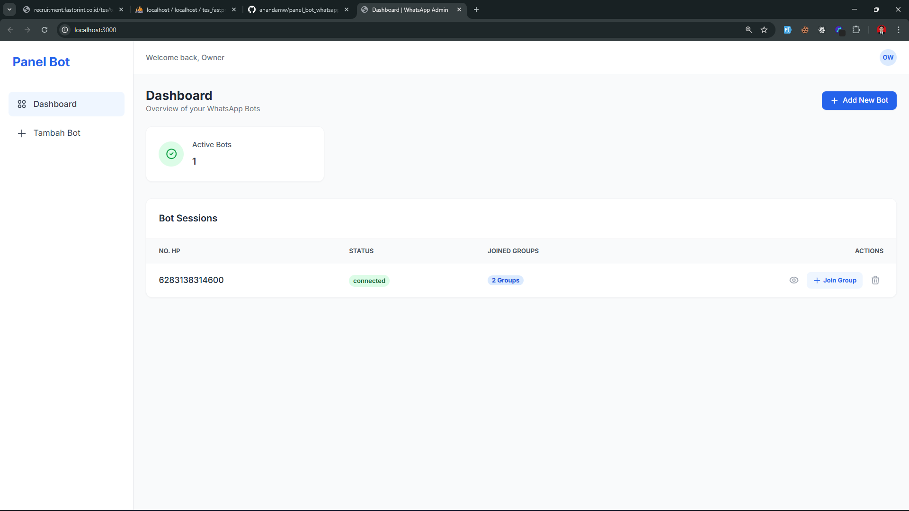

# Panel Bot WhatsApp

A powerful and intuitive WhatsApp Bot management panel built with Node.js, Express, and WhatsApp-web.js. This application allows you to manage multiple WhatsApp bot sessions, join groups, and monitor bot status through a web-based dashboard.



## 🚀 Features

- **Multi-Session Management**: Run and manage multiple WhatsApp bot sessions simultaneously.
- **QR Code Scanning**: Easy authentication via QR code in the browser.
- **Real-time Monitoring**: Monitor bot status and connections in real-time using Socket.io.
- **Group Management**: Join groups directly from the panel.
- **Session Persistence**: Restores bot sessions automatically after server restarts.
- **Modern UI**: Styled with TailwindCSS for a clean and responsive experience.
- **Database Integration**: MySQL backend for storing session information and bot data.

## 🛠️ Tech Stack

- **Backend**: Node.js, Express.js
- **Frontend**: EJS (Embedded JavaScript Templates), TailwindCSS
- **Real-time**: Socket.io
- **WhatsApp Integration**: [whatsapp-web.js](https://github.com/pedroslopez/whatsapp-web.js)
- **Database**: MySQL (via `mysql2`)
- **Process Management**: PM2 support included

## 📋 Prerequisites

Before you begin, ensure you have the following installed:

- [Node.js](https://nodejs.org/) (LTS version recommended)
- [MySQL](https://www.mysql.com/) (or Laragon/XAMPP)
- npm (comes with Node.js)

## ⚙️ Installation

1. **Clone the repository**:

   ```bash
   git clone https://github.com/yourusername/panel-bot-whatsapp.git
   cd panel-bot-whatsapp
   ```

2. **Install dependencies**:

   ```bash
   npm install
   ```

3. **Configure Environment Variables**:
   Copy `.env.example` to `.env` and update the database credentials.

   ```bash
   cp .env.example .env
   ```

   Edit `.env`:

   ```env
   APP_NAME="Panel Bot WA"
   PORT=3000
   DB_HOST=127.0.0.1
   DB_USER=root
   DB_PASSWORD=
   DB_NAME=panel-bot-whatsapp
   ```

4. **Database Setup**:
   Import `panel-bot-whatsapp.sql` into your MySQL database.

## 🚀 Running the App

### Development Mode

```bash
npm run dev
```

### Production Mode

```bash
npm start
```

### Running with PM2

```bash
npm run pm2
```

## 📂 Project Structure

```text
src/
├── controllers/    # Request handlers
├── database/       # DB connection & config
├── middleware/     # Custom Express middleware
├── repositories/   # Data access layer
├── routes/         # API & Web routes
├── services/       # Business logic (BotManager, WhatsApp)
├── utils/          # Helper functions
├── views/          # EJS templates
└── server.js       # Entry point
```

## 🤝 Contributing

Contributions are welcome! Please feel free to submit a Pull Request.

## � Developer

- **Name**: anandamw
- **Portfolio**: [anandamw.site](https://anandamw.site)

## �📄 License

This project is licensed under the ISC License.
